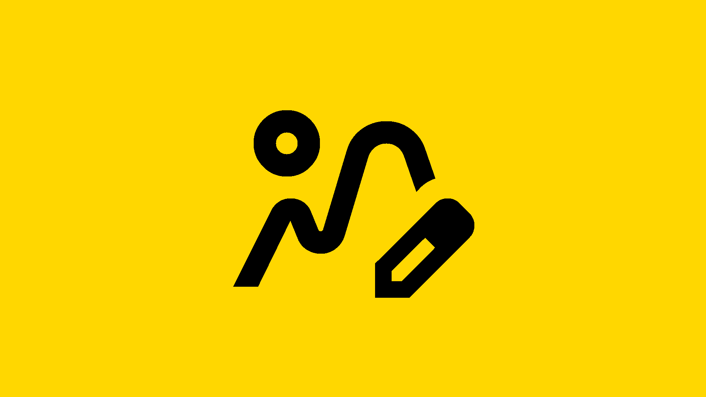
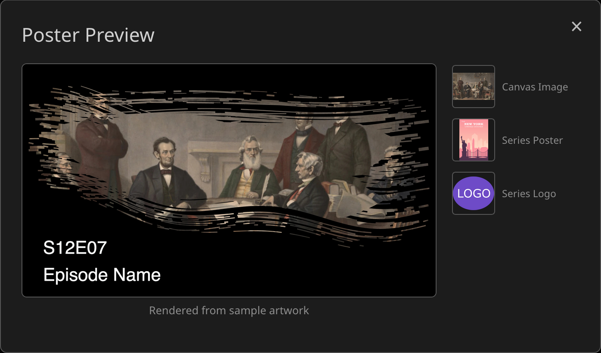

# 

A Jellyfin plugin that generates artwork for TV shows and films using smart frame analysis, black frame detection, letterbox detection, and configurable styling. It makes episode posters, portrait series, season, and movie posters, thumbs, backdrops, and text logos, filling in missing or generic artwork with clean, consistent visuals.

## How It Works

Artwork Generator scans video files, evaluates multiple frames, and selects strong candidates while avoiding fades, black screens, and letterboxed shots. The selected frame is turned into an image and optionally styled with configurable text such as a title or numbering. Seasons and series use frames from their own episodes, and a film uses its own video.

Configuration is split into three parts:

* **Designs** set how a poster looks. Each design draws both portrait and landscape, so one design covers a tall series poster and a wide thumb, and the page previews both at once.
* **Logos** set how a text logo looks: which name it uses, how that name is cleaned up, and its font and fill. A name split by a colon or dash can be drawn with either part large and the other small, and the letters can be filled with a frame from the show instead of a color.
* **Profiles** choose which images are made for series, seasons, episodes, and films, and which design draws each. Anything not assigned to a profile uses the default.

Every image of one item draws from a shared set of frames, so a series' poster, thumb, backdrop, and photo logo show different shots from the same pool. A fixed seed in Settings makes frame choice repeatable.

A series poster shows only the show's name. Styles built around an episode number adapt to that: Cutout punches the name itself out of the overlay, and Timeline drops its progress bar.

The plugin runs entirely as a Jellyfin metadata provider. There are two ways to get a poster:

* **Automatically** — a metadata refresh generates any image the item's profile turns on that the item is missing. This is the default; it can be turned off in Settings.
* **By hand** — open an item, choose **Edit Images**, and press the search button on an image type. Generated images appear alongside the usual providers, each rendered from a different frame, so you can pick the one you like instead of refreshing until a good frame comes up.

For series, season, and movie images, tick **Artwork Generator** under Image Fetchers for those item types in each library's settings. Jellyfin only asks enabled fetchers for images.

There is no scheduled task. Use Jellyfin's own metadata refresh, on a library or a single item, to generate in bulk.

## Poster Styles

### Standard Style
Simple screenshot with optional season/episode information.

| Example 1 | Example 2 | Example 3 |
|-----------|-----------|-----------|
|  |  |  |

### Brush Style  
Flat color with a transparent brush cutout revealing the screenshot beneath, with optional season/episode information to the side.

| Example 1 | Example 2 | Example 3 |
|-----------|-----------|-----------|
|  |  |  |

### Cutout Style  
Large numbers displayed as transparent cutouts revealing the frame beneath, with an optional title.

| Example 1 | Example 2 | Example 3 |
|-----------|-----------|-----------|
|  |  |  |

**Cutout Types:**
- **Code**: Displays episode in format "S01E03" 
- **Text**: Displays episode number as words (e.g., "THREE")

### Frame Style
Decorative frame borders with the title and an optional subtitle.

| Example 1 | Example 2 | Example 3 |
|-----------|-----------|-----------|
|  |  |  |

### Logo Style
Series logo focused posters with optional season/episode information.

| Example 1 | Example 2 | Example 3 |
|-----------|-----------|-----------|
|  |  |  |

### Numeral Style
Roman numeral episode numbers with optional overlapping title.

| Example 1 | Example 2 | Example 3 |
|-----------|-----------|-----------|
|  |  |  |

### Split Style
Episode screenshot with overlay text and episode information, split alongside the series poster.

| Example 1 | Example 2 | Example 3 |
|-----------|-----------|-----------|
|  |  |  |

### Frosted Glass Style
Episode information on a frosted glass panel that blurs the screenshot behind it.

| Example 1 | Example 2 | Example 3 |
|-----------|-----------|-----------|
|  |  |  |

### Fade Style
One sided color fade with a large number and a vertical title.

| Example 1 | Example 2 | Example 3 |
|-----------|-----------|-----------|
|  |  |  |

### Striped Style
Tilted color sash with pinstripes carrying the title, with the subtitle in the corner.

| Example 1 | Example 2 | Example 3 |
|-----------|-----------|-----------|
|  |  |  |

### Timeline Style
Progress bar filled to the item's position, with an optional title and subtitle.

| Example 1 | Example 2 | Example 3 |
|-----------|-----------|-----------|
|  |  |  |

### Palette Derived Colors
Overlay colors sampled from the dominant color of each episode's frame instead of a fixed color. Works with every style. The configured alpha values are preserved.

| Brush | Cutout | Fade |
|-------|--------|------|
|  |  |  |

## Poster Architecture

The Artwork Generator uses a four layer rendering pipeline to create consistent posters across all styles:

### Layer 1: Canvas (Base Layer)
The foundation layer that provides the visual background for the poster.

**Options:**

- **Video Frame Extraction**: Automatically extracts a frame from the episode video file using configurable extraction windows. Candidates are sampled at widely spaced points across the window until one with adequate brightness and sharpness is found; the best scoring candidate is used as a fallback. The sampling starts from a different point on each run, so refreshing an episode offers a different frame rather than the same one.
- **Series Backdrop**: Uses the series' own backdrop image as the poster background, falling back to a transparent canvas when the series has none.
- **Transparent Background**: Creates a solid color or transparent canvas.

**Processing:**
- HDR brightening for HDR content
- Letterbox/pillarbox detection and cropping
- Aspect ratio adjustments and fill strategies

### Layer 2: Overlay (Color Tinting)
A translucent color layer applied over the canvas to enhance text readability and create visual cohesion.

**Features:**
- Configurable ARGB hex colors with alpha transparency
- Applied uniformly across the entire poster surface or use two colors blurred together
- Optional palette derived colors: the overlay color is sampled per episode from the dominant color of the frame, while the configured alpha is preserved

### Layer 3: Graphics (Static Images)
Optional static graphic overlays positioned above the canvas but below text elements.

**Capabilities:**
- User configurable file path for custom graphics
- Automatic sizing and positioning within safe area boundaries
- Supports PNG, JPG, and WEBP formats
- Maintains aspect ratio while fitting within poster constraints

### Layer 4: Typography (Text and Logos)
The top layer containing all text elements, episode information, and series logos.

**Elements:**
- Episode numbers and season information
- Episode titles with automatic text wrapping, and configurable handling for titles too long to fit
- Series logos with configurable positioning
- Style specific typography (Roman numerals, cutout text, etc.)
- Drop shadows and contrasting outlines for enhanced readability

### Rendering Pipeline
Each poster style follows this exact four layer sequence. The modular approach allows for easy customization and additional poster styles.

Elements that stack vertically — logo, title, subtitle — are measured before any of them are placed, so they keep a consistent gap and cannot overlap. That gap is the **Element Spacing** setting, applied the same way by every style.

## Usage & Documentation

### Settings
For an explanation of the settings, visit [SETTINGS.md](docs/SETTINGS.md).

### Template examples & downloads
For additional template examples and downloadable configurations, visit [EXAMPLES.md](docs/EXAMPLES.md).

### Preview your poster
A live preview at the top of the Designs page renders your current settings against sample artwork in both shapes at once, and updates as you change them. Choose whether it shows a series, a season, or an episode. The Logos page previews logos the same way, against a sample name you type. Click the preview to enlarge it, or click a component thumbnail to see the artwork feeding it.


---

## Versioning

Releases use a four part version, `JJ.JJ.F.B`, that matches the supported Jellyfin version with the plugin's own feature/bug count:

```
12.0.1.2
└──┘ └┬┘
 │    └── 1 = Plugin feature release
 │        2 = Plugin bug/patch release within that feature
 │
 └─── 12.0 = Jellyfin version this build was tested/released for
```

## Installation

### Step 1: Add Plugin Repository

* Open Jellyfin and navigate to Dashboard → Plugins → Repositories
* Click Add Repository
* Enter the following repository URL: `https://raw.githubusercontent.com/JPKribs/jellyfin-plugin-episodepostergenerator/master/manifest.json`
* Click Save

### Step 2: Install Plugin

* Go to the Catalog tab in the Plugins section
* Find Artwork Generator in the catalog
* Click Install
* Wait for installation to complete

### Step 3: Restart Jellyfin

* Restart your Jellyfin server completely
* Wait for Jellyfin to fully start up

### Verification Check

* After restart, navigate to Dashboard → Plugins → Artwork Generator to confirm the plugin configuration page loads properly.

---

## AI Disclaimer

Claude Code was utilized in the initial structure of this project and first drafts of documentation. All code has been manually reviewed, tested, and revised after its generation. This disclaimer exists in the interest of transparency.

**All code was written, or code reviewed and tested, by humans.**
